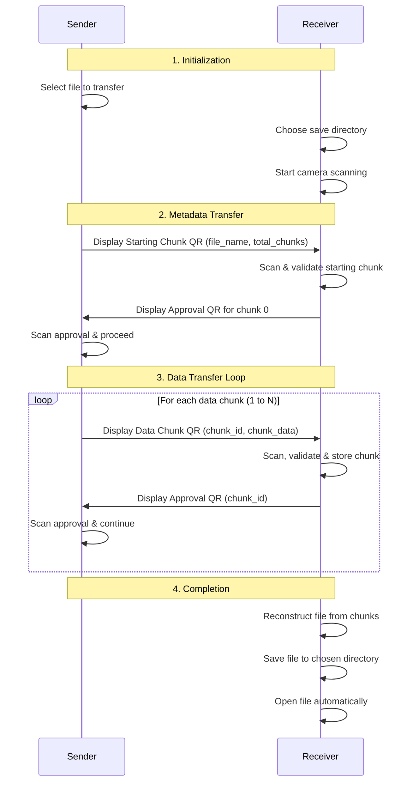

# File Transfer Over Camera

A Python application that enables secure file transfer between devices using QR codes and camera capture with automated positioning and modular architecture.

## Features

- 📁 **Any File Type**: Transfer any file (text, images, documents, etc.)
- 📱 **QR Code Protocol**: Chunked file transfer using QR codes
- 📹 **Camera Integration**: Uses device camera for QR code scanning
- ✅ **Automatic Acknowledgment**: Built-in approval system for reliable transfer
- 🔄 **Automated Flow**: No manual intervention required during transfer
- 🎯 **Progress Tracking**: Real-time transfer progress indicators
- 🎨 **Centered QR Display**: QR codes automatically positioned in screen center
- 🏗️ **Modular Architecture**: Clean separation of concerns with utility modules

## Installation

```bash
# Clone or download the project
git clone https://github.com/tomercahal/fileTransferOverCam.git
cd fileTransferOverCam

# Install dependencies
pip install -r requirements.txt

# Run the application
python main.py receiver  # On receiving device
python main.py sender    # On sending device
```

## Requirements

- **Python 3.8+**
- **Camera/Webcam** on both devices
- **Dependencies** (auto-installed):
  - `qrcode[pil]` - QR code generation
  - `opencv-python>=4.6.0` - Camera capture and QR detection
  - `Pillow` - Image processing
  - `numpy` - Array processing for image data
  - `pywin32` - Windows-specific window management (Windows only)
  - `tkinter` - GUI (included with Python)

## Usage

### Quick Start

1. **On Receiving Device:**
   ```bash
   python main.py receiver
   ```
   - Application opens and waits for transfer
   - Point camera at sender's QR codes

2. **On Sending Device:**
   ```bash
   python main.py sender
   ```
   - Select file to transfer
   - QR codes are displayed automatically
   - Point receiver's camera at the QR codes

### Transfer Process

1. Sender displays QR code with file metadata
2. Receiver scans and shows approval QR
3. Sender detects approval and shows first data chunk
4. Process repeats until all chunks transferred
5. File automatically saved on receiver

## File Structure

```
file-transfer-over-cam/
├── main.py              # Entry point - choose sender/receiver mode
├── sender.py            # Sender functionality - file selection & transfer coordination
├── receiver.py          # Receiver functionality - scanning & file reconstruction
├── camera_handler.py    # Camera operations - capture & QR detection
├── protocol_utils.py    # Protocol logic - chunking, serialization, validation
├── display_utils.py     # QR display utilities - window management & positioning
├── file_utils.py        # File I/O utilities - selection, reading, saving
├── requirements.txt     # Python dependencies
└── README.md           # This file
```

## Architecture

### Modular Design
- **`display_utils.py`**: QR window management, centered positioning, focus control
- **`file_utils.py`**: File selection dialogs, reading, saving, and opening files
- **`protocol_utils.py`**: Data chunking, JSON serialization, base64 encoding
- **`camera_handler.py`**: Camera operations and QR code detection
- **`sender.py`** & **`receiver.py`**: Transfer coordination and logic

### Protocol Details
- **Chunking**: Large files split into manageable chunks (100 bytes default)
- **Encoding**: JSON payloads with base64-encoded binary data
- **Acknowledgment**: Each chunk requires approval before proceeding
- **Error Handling**: Duplicate chunk detection, invalid payload validation
- **Display**: QR codes automatically centered on screen for consistent camera alignment
- **Window Management**: Proper window focusing and cleanup

## Protocol Flow

### Transfer Sequence



### Data Structure

#### Starting Chunk (Metadata)
```json
{
  "id": 0,
  "data": "U1RBUlRJTkc=",  // base64 for "STARTING"
  "file_name": "example.txt",
  "total_chunks": 5
}
```

#### Data Chunk
```json
{
  "id": 1,
  "data": "SGVsbG8gV29ybGQ="  // base64 encoded file chunk
}
```

#### Approval Chunk
```json
{
  "id": 1,
  "data": "QVBQUM9WRUQ="  // base64 for "APPROVED"
}
```

### Error Recovery

1. **Invalid QR Detection**: Receiver ignores unreadable/malformed QR codes
2. **Duplicate Chunks**: Receiver detects and ignores already received chunks
3. **Missing Approval**: Sender waits indefinitely for approval before proceeding
4. **Camera Issues**: Both sides handle camera failures gracefully with retries

## Troubleshooting

### Camera Issues
- Ensure camera permissions are granted
- Check if camera is being used by another application
- Try different camera indices if multiple cameras available

### QR Code Detection
- Ensure good lighting conditions
- Hold camera steady and at appropriate distance
- Clean camera lens if blurry
- QR codes are automatically centered on screen for easier camera alignment

### Window Management Issues
- On Windows, install pywin32 for proper window focusing: `pip install pywin32`
- If QR windows don't appear centered, check display scaling settings
- Multiple monitors may affect positioning - use primary display

## Author

Tomer Cahal
Created for Computer Networks Workshop Final Project.